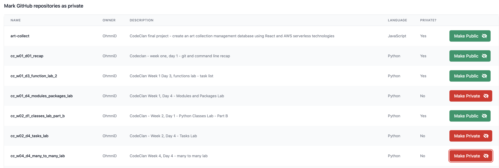

# Bulk Mark GitHub Repositories As Private

## Synopsis

At the end of the CodeClan Professional Software Development course, I wanted to mark all my GitHub coursework repos as private - a cumbersome manual process using the GitHub GUI. I wrote this quick and dirty React app to retrieve all your GitHub repos, any that are marked as public will have a button to toggle them between public and private. I have implemented a filter to only show repos for your username, just in case you accidentally mark someone else's shared repo as private! Repos that are forks cannot be made private, if there is any other cases that cause the program to fail please let me know.

## Instructions

- Download/clone the repo into a folder on your local computer
- Navigate to that using the command line and run `npm install`
- While that is downloading and installing, get a Personal Access Token for your GitHub account (make sure it has read/write access to all your repos and read access to your user)
- In the services folder, rename auth.template.js to auth.js
- Open this and paste in your PAT where prompted, also enter your GitHub username (this is case sensitive)
- Start the server using `npm start`
- Browse to http://localhost:3000 and you should see your repos listed, and be able to mark any public ones as private

## Other notes

- I made the pagination size 7 items so each page would fit on my laptop screen without scrolling (because I was proud I got pagination to work!) - change this by modifying the variable perPage on line 15 of App.js (up to a maximum of 100)

